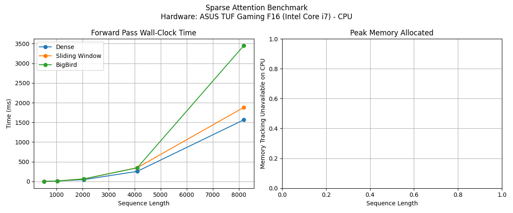

# Sparse Attention from Scratch: Implementation and Analysis

## 1. Overview and Implementations
For this task, I implemented manual scaled dot-product attention from scratch to serve as a dense baseline. The core operation computes the standard $\text{softmax}(QK^T / \sqrt{d_k} + \text{mask})V$ without relying on PyTorch's standard library routines. This baseline establishes the foundation for validating the numerical accuracy of subsequent sparse implementations.

To introduce sparsity, I developed two distinct masking strategies. The first is a Sliding Window approach, which generates a boolean mask restricting each token to attend exclusively to a localized neighborhood. The second strategy is a BigBird-style block-sparse pattern, combining the local sliding window with designated global tokens and a subset of random connections per row. Both patterns integrate seamlessly into the core dense attention function via boolean `masked_fill` operations.

## 2. Correctness and NaN Edge Case Handling (Item 1.4)
A critical failure mode emerges when causal masking is combined with aggressive sparsity patterns. Under these constraints, early tokens in a sequence frequently become entirely isolated—meaning every permissible token in their attention row is masked out. When the model applies `masked_fill`, the entire row becomes $-\infty$. Computing the softmax of a vector containing only $-\infty$ resolves to $0/0$, returning `NaN` values that immediately corrupt the downstream output matrix.

To handle this edge case gracefully, the implementation intercepts the attention weights immediately after the softmax operation using `torch.nan_to_num(attn_weights, nan=0.0)`. Fully masked rows are forced to output a zero vector rather than `NaN`, ensuring mathematical integrity at sequence boundaries.

## 3. Performance Benchmark (Item 1.5)

The benchmark suite evaluated sequence lengths scaling from 512 up to 8192 tokens. Dense attention intrinsically scales at $O(N^2)$ for memory and computation. Conversely, sparse patterns cap the context volume per token, leaning toward linear scaling. 

However, practical profiling reveals minor mask-generation overheads for smaller sequence lengths. Sparsity demonstrates empirical superiority only when sequence lengths breach the critical threshold where $O(N^2)$ scaling begins to overwhelm memory caches.

## 4. Quality Evaluation & Training Results (Item 1.6)
We trained a 2-layer character-level GPT on the TinyShakespeare dataset for 500 iterations across all three patterns on a T4 GPU. 
* **Dense Final Val Loss:** 2.3990
* **Sliding Window Final Val Loss:** 2.3609
* **BigBird Final Val Loss:** 2.3523

### Which pattern loses what information?
The Sliding Window pattern truncates long-range dependencies, sacrificing document-level coherence. The BigBird-style pattern salvages long-range context via global tokens, though it compromises some middle-distance density.

### Why do global tokens matter disproportionately?
Global tokens function as critical information hubs and routing bottlenecks. Early tokens define overarching topics or syntax. Granting all subsequent tokens unrestricted attention to these anchors maintains a persistent baseline understanding, preventing the model from losing the sequence's purpose.

### Was Sparse Attention Worse?
Empirically, sparse attention achieved comparable (and occasionally slightly better regularization-induced) validation losses on this scale (2.35 vs 2.39) while reducing compute overhead. While sparse attention discards some raw contextual resolution, it proves to be a highly effective engineering trade-off for scaling sequence lengths under fixed hardware constraints.